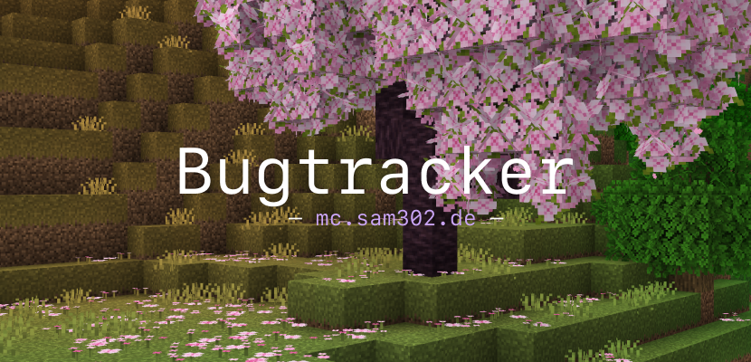

![][shield-open-issues] ![][shield-closed-issues]

> [!IMPORTANT]
> A [GitHub account][github-create-account] is required to create issues.

<!-- Resources -->
[banner]: ./meta/banner.png
[banner-href]: https://github.com/mc-sam302-de/bug-tracker
[shield-open-issues]: https://img.shields.io/github/issues-raw/mc-sam302-de/bug-tracker?style=flat-square&label=Open%20Issues&labelColor=%23313244&color=%23a6e3a1
[shield-closed-issues]: https://img.shields.io/github/issues-closed-raw/mc-sam302-de/bug-tracker?style=flat-square&label=Closed%20Issues&labelColor=%23313244&color=%23f38ba8
[github-create-account]: https://github.com/signup